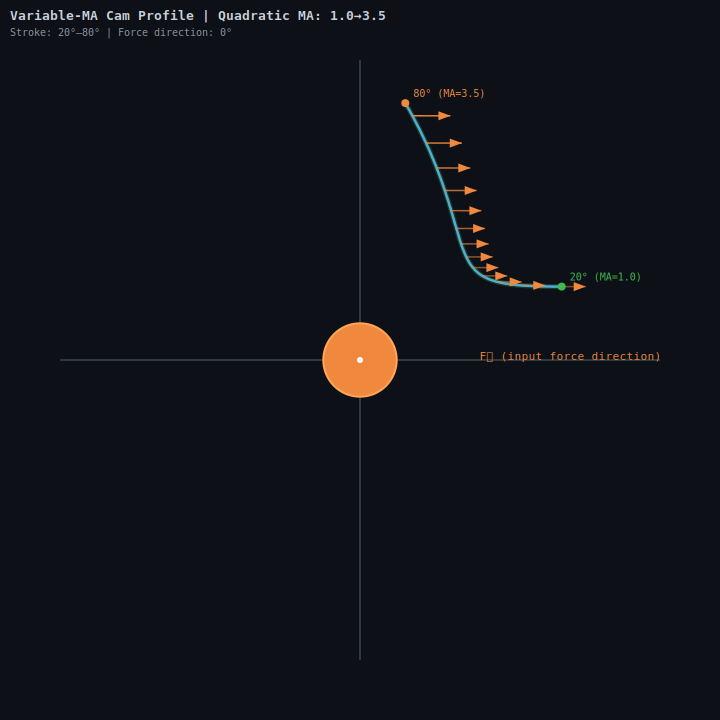
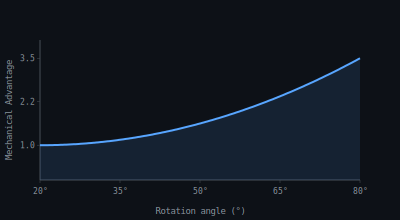

# hyperpoly-terrain

**Part of the MANIFOLD field computation system.**  
**Copyright (c) 2026 Guinea Pig Trench LLC**

---

**GPU-native material-first terrain simulation engine. Real-time erosion, fluid dynamics, collision, and feature-preserving mesh extraction. WebGPU, zero host-GPU sync.**

## Preview

<a href="game/index.html">
  
</a>
<a href="game/index.html">
  
</a>

*Open `game/index.html` in a WebGPU-capable browser (Chrome/Edge) for the interactive 3D demo.*

## What It Does

In simple terms: **Hyperpoly runs physics on the GPU** — rain falls, water flows downhill, dirt erodes, sediment deposits, and you get realistic terrain without a game engine. Every computation stays on the GPU. The CPU never touches a vertex.

The same 6-channel tensor architecture maps to domains beyond terrain: LiDAR array calibration, drone swarm coordination, legal case documentation — the substrate changes, the field computation doesn't.

## Architecture

This is a **field computation system** that demos terrain. The same architecture calibrates LiDAR arrays, coordinates drone swarms, and documents legal cases. See [the domain-agnostic reference](https://github.com/COMMENCINGTHESCOURGE/hyperpoly-terrain/wiki) for mapping the 6-channel tensor to your domain.

### The 6-Channel Tensor

| Channel | Terrain Interpretation | LiDAR Interpretation | Swarm Interpretation |
|---------|----------------------|---------------------|---------------------|
| density | Voxel occupancy | Optical power density | Drone density |
| cohesion | Rock integrity | Phase coherence | Inter-agent trust |
| permeability | Fluid flow (directional) | Atmospheric transmission | Communication bandwidth |
| water | Groundwater saturation | Water vapor / turbulence | Shared awareness |
| sediment | Erosion product | Particulate scattering | Memory decay |
| oxidation | Weathering rate | Thermal gradient | Decision staleness |

## Quick Start

```bash
# Requires browser with WebGPU support
git clone https://github.com/COMMENCINGTHESCOURGE/hyperpoly-terrain.git
cd hyperpoly-terrain
# Open game/index.html in Chrome/Edge
```

Controls:
- **WASD** — move
- **Mouse** — look
- **Shift** — sprint
- **GEMS** — collect 20 scattered across the terrain

## Validation

Rainfall pulse validation confirms deterministic physics:

| Metric | Result |
|--------|--------|
| Mass drift | < 0.001% over 50 ticks |
| Queue compaction | No duplicate or OOB indices |
| Wetting front | Propagates at Darcy velocity |
| Testing | Dual-mode: JS proxy (algorithmic) + GPU (real WGSL) |

## Project Structure

| Path | Contents |
|------|----------|
| `game/index.html` | Interactive WebGPU open world (Three.js + noise terrain) |
| `game/compute/` | WGSL compute shaders for erosion, fluid, collision |
| `cam/` | Camera profile renders (SVG terrain cross-sections) |
| `bridge/` | Fractype schema — JSON+Python bridge between layers |
| `checker/` | Fractype validation checker (pytest) |
| `dashboard/` | Python dashboard for monitoring field state |
| `extension/` | Browser extension for live field inspection |
| `film/` | Python render pipeline + Kaggle notebook for batch rendering |

## Related

- [`trench-builder`](https://github.com/COMMENCINGTHESCOURGE/trench-builder) — Open world integration demo (Three.js, procedural construction)
- [Domain-agnostic reference](https://github.com/COMMENCINGTHESCOURGE/hyperpoly-terrain/wiki) — 6-channel tensor mapped to LiDAR, swarms, legal

## Entity

| Field | Value |
|-------|-------|
| Copyright | Guinea Pig Trench LLC |
| R&D Entity | Guinea Pig Trench LLC (PA, #13674084) |
| Credit Facility | Truth Holds Enterprise (PA, #7049023) |
